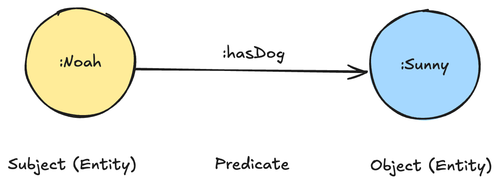

import Callout from "../../components/Callout.astro";
import CaptionedImage from "../../components/CaptionedImage.astro";
import pepRdfSchema from "../../images/blog/exploring-peps/pep_schema.png";
import pep484 from "../../images/blog/exploring-peps/pep_484.png";

## Inspiration 🌟

The Python programming language has been around for over 30 years and has evolved significantly over that time. One of the ways that the Python community has managed this evolution is through Python Enhancement Proposals (PEPs). PEPs are design documents that provide information to the Python community or describe a new feature for Python or its processes. They are the primary mechanism for proposing major new features, for collecting community input on an issue, and for documenting the design decisions that have gone into Python.

Recently, I found myself looking at [Python Enhancement Proposal (PEP) 484 - Type Hints](https://peps.python.org/pep-0484/) (I know how to have fun, I promise 🕺). In my opinion, PEP 484 has been one of the most impactful PEPs in recent years. It had me wondering who the authors were and what other PEPs they had contributed to. That proposal's webpage had 3 authors listed ([Guido van Rossum](https://en.wikipedia.org/wiki/Guido_van_Rossum), Jukka Lehtosalo, Łukasz Langa). I recognized Guido van Rossum as the creator and formerly the "BDFL" (benevolent dictator for life) of Python, but I didn't recognize the other two names. I thought it would be interesting to see what other PEPs these authors have contributed to. All this information is [available on the fantastic and well documented PEP site](https://peps.python.org/pep-0000/#index-by-category), but I thought it would be interesting to explore and [visualize](#visualizing-the-pep-data) this data as a graph using [RDF](https://en.wikipedia.org/wiki/Resource_Description_Framework) and Python, especially since the PEPs site has a [JSON API](https://peps.python.org/api/peps.json) making it easy fetch all PEPs and their associated metadata from. So here I am, writing a blog post about it!

<CaptionedImage src={pep484} alt="PEP 484">
[PEP 484](https://peps.python.org/pep-0484/) was authored by Guido van Rossum, Jukka Lehtosalo, and Łukasz Langa.
</CaptionedImage>

I wouldn’t call this work groundbreaking by any means, but it was a fun and engaging project and I learned a little bit how Python has evolved over the years. I started using Python regularly around when version 3.8 (3.13 was just recently released at time of writing) was released so it was really interesting to see which features were added when and why.

I believe the same methodology for exploring this data can be applied to many other datasets and domains to uncover insights and knowledge. If you are new to RDF or [SPARQL](https://en.wikipedia.org/wiki/SPARQL), this post will hopefully give you a high-level overview of what they are and how they can be used to represent and query data in a graph. You can find all the associated code used to generate the RDF and visualizations in the [GitHub repository](https://github.com/noahgorstein/exploring-peps) associated with this post.

<Callout intent="info">
If you are not familiar with RDF or want a refresher, I highly recommend checking out Bob DuCharme's blog post, ["What is RDF?"](https://www.bobdc.com/blog/whatisrdf/). Bob also has [numerous other](https://www.bobdc.com/categories/rdf/) high quality and informative blog posts on all things RDF.
</Callout>

<Callout intent="random">
While on the PEPs site, I came across [PEP 801](https://peps.python.org/pep-0801/), titled "Reserved" authored by Barry Warsaw from 2018. The abstract is the following: "This PEP is reserved for future use, because **We are the 801**. Contact the author for details.", with a YouTube link to Brian Eno's, "The True Wheel" 🤣. 

<iframe width="auto" height="315" src="https://www.youtube.com/embed/p4atQSktICE?si=pDFt0yJTb1FfT_6G" title="YouTube video player" frameborder="0" allow="accelerometer; autoplay; clipboard-write; encrypted-media; gyroscope; picture-in-picture; web-share" referrerpolicy="strict-origin-when-cross-origin" allowfullscreen></iframe>

</Callout>

## Mapping the PEP API to RDF

Before mapping the JSON data served from the API to RDF, I had to decide what the RDF schema should look like, such that it could represent the PEPs, authors, and their relationships in the graph in such a way that I could query the data using SPARQL later on to answer questions like "What PEPs has Guido van Rossum authored?" or "What PEPs, if any, have been superseded by PEP 484?". The schema allows me to use a defined and consistent vocabulary to describe the data I want to represent and query in the graph. An RDF schema is similar to a typical SQL database schema in that it defines the *structure of the data*, just in the graph. 

### Creating the RDF Schema 

The PEP data from the API is nicely structured and contains a lot of useful metadata about each PEP. There is [some documentation](https://peps.python.org/api/) on the PEPs site about the JSON API, describing what each field represents and their possible values.

Here's an example of the JSON data for PEP 484 and 622:

```json
  "484": {
    "number": 484,
    "title": "Type Hints",
    "authors": "Guido van Rossum, Jukka Lehtosalo, Łukasz Langa",
    "discussions_to": "python-dev@python.org",
    "status": "Final",
    "type": "Standards Track",
    "topic": "typing",
    "created": "29-Sep-2014",
    "python_version": "3.5",
    "post_history": "16-Jan-2015, 20-Mar-2015, 17-Apr-2015, 20-May-2015, 22-May-2015",
    "resolution": "https://mail.python.org/pipermail/python-dev/2015-May/140104.html",
    "requires": null,
    "replaces": null,
    "superseded_by": null,
    "url": "https://peps.python.org/pep-0484/"
  },
  "622": {
    "number": 622,
    "title": "Structural Pattern Matching",
    "authors": "Brandt Bucher, Daniel F Moisset, Tobias Kohn, Ivan Levkivskyi, Guido van Rossum, Talin",
    "discussions_to": "python-dev@python.org",
    "status": "Superseded",
    "type": "Standards Track",
    "topic": "",
    "created": "23-Jun-2020",
    "python_version": "3.10",
    "post_history": "23-Jun-2020, 08-Jul-2020",
    "resolution": null,
    "requires": null,
    "replaces": null,
    "superseded_by": "634",
    "url": "https://peps.python.org/pep-0622/"
  }
}
```

I'm by no means an expert in RDF modeling or building what are known more formally as [ontologies](https://en.wikipedia.org/wiki/Ontology_(information_science)), but when creating the RDF schema for a dataset, I like to think about the main entities (nodes in the graph commonly referred to as *classes*), their relationships (edges in the graph commonly referred to as *object properties*), and their attributes (referred to as *datatype properties*). Object properties are relationships between two entities/nodes, while datatype properties are relationships between an entity/node and a literal value. It's kind of like the difference between a foreign key in a database and a column in a SQL table.

Here is how I broke down the PEP data into a schema:

| Classes | Object Properties | Datatype Properties |
| --- | --- | ---
| Python Enhancement Proposal (PEP) | hasAuthor, hasPost, hasResolution,  replaces, supersededBy | title, status, dateCreated, url, type, topic |
| Author | | name  |
| Post | | postUrl, postDate  |
| Resolution | | resolutionUrl, resolutionDate  |

Here is a visualization of the RDF schema, excluding the datatype properties:

<CaptionedImage src={pepRdfSchema} alt="RDF Schema for Python Enhancement Proposals (PEPs)">
This visualization of the schema was actually generated by one of [Stardog's](https://www.stardog.com/) (my employer) tools, [Stardog Explorer](https://www.stardog.com/explorer/), which is a web-based tool for exploring your Stardog database. It also does a great job of visualizing the schema of your database. 
</CaptionedImage>

<Callout intent="info">
The datatype properties in the schema are not included in the visualization, but they are important for representing the literal values associated with the entities in the graph. You can find the entire [schema serialized in Turtle](https://github.com/noahgorstein/exploring-peps/blob/main/generated/schema.ttl) in the GitHub repository associated with this post. 

The schema (and RDF generally speaking) is represented as a series of what are known as *triples*, where each triple is a statement that consists of a *subject*, *predicate*, and *object*. The subject is the entity or node in the graph, the predicate is the relationship between the subject and object, and the object is the entity or literal value. 



It makes a bit more sense when the triple almost reads like an English statement. For example:
- "Noah has a dog Sunny"
- "pep 484 has an author Guido van Rossum"
- "pep 484 has a title Type Hints"

It becomes a little more "meta" when you think about the schema itself being represented as triples in the graph, but that's all it is! They are just statements about the data in the graph. For example, below is the Turtle serialization of the datatype property `pep:type`, which represents the type of the PEP ("Informational", "Standard Track", etc). It says that the property `pep:type` is a `owl:DatatypeProperty` with a domain of `pep:PythonEnhancementProposal` and a range of `xsd:string`, meaning that the property `pep:type` is a property on the class `pep:PythonEnhancementProposal` that has a value that is a string:

```turtle
@prefix owl: <http://www.w3.org/2002/07/owl#> .
@prefix peps: <http://python.org/peps/schema/> .
@prefix rdfs: <http://www.w3.org/2000/01/rdf-schema#> .
@prefix xsd: <http://www.w3.org/2001/XMLSchema#> .

peps:type a owl:DatatypeProperty ;
    rdfs:label "PEP type" ;
    rdfs:comment "The type of the PEP" ;
    rdfs:domain peps:PythonEnhancementProposal ;
    rdfs:range xsd:string .
```

I am glossing over some details here, but do note, you don't always have to define your own schema. There are many existing vocabularies and ontologies that you can use to represent your data. For example, the [Schema.org](https://schema.org/) vocabulary is a widely used vocabulary for representing structured data on the web. In fact, depending on what you are doing, it may be better to use an existing vocabulary rather than defining your own.

</Callout>

### Populating the RDF Graph with PEP Data

Now that I had the schema, I could start populating the graph with the actual PEP data from the API, ensuring that the data adhered to the schema, so that I could query it later on using my defined vocabulary from the schema. I wrote a Python script that read the JSON data from the PEPs API, transformed it into RDF triples, and then wrote the triples to a file. You can find this code in the [GitHub repository](https://github.com/noahgorstein/exploring-peps/blob/main/src/main.py) associated with this post.

The below Turtle snippet represents  [PEP 484](https://peps.python.org/pep-0484/) in RDF:


```turtle
@prefix : <https://python.org/peps/> .
@prefix peps: <https://noahgorstein.com/peps/schema/> .
@prefix rdfs: <http://www.w3.org/2000/01/rdf-schema#> .
@prefix xsd: <http://www.w3.org/2001/XMLSchema#> .

:pep-402 a peps:PythonEnhancementProposal ;
    rdfs:label "Simplified Package Layout and Partitioning" ;
    peps:dateCreated "2011-07-12"^^xsd:date ;
    peps:hasAuthor <http://python.org/peps/author/Phillip+J.+Eby> ;
    peps:hasPost [ a pep:Post ;
            peps:postDate "2011-07-20"^^xsd:date ] ;
    peps:id "402"^^xsd:int ;
    peps:replaces :pep-382 ;
    peps:status "Rejected" ;
    peps:title "Simplified Package Layout and Partitioning" ;
    peps:topic "packaging" ;
    peps:type "Standards Track" ;
    peps:url "https://peps.python.org/pep-0402/"^^xsd:anyURI .

```

- The subject is `:pep-484`, which is the URI for PEP 484.
- The predicate is `peps:hasAuthor`, which is the relationship between the PEP and its author (Phillip J. Eby).
- The predicate `peps:dateCreated` is the relationship between the PEP and the date it was created (July 12, 2011).
- The predicate `peps:hasPost` is the relationship between the PEP and a post associated with it. The `[ a pep:Post ; pep:postDate "2011-07-20"^^xsd:date ]` is a [blank node](https://en.wikipedia.org/wiki/Blank_node), which is a node in the graph that doesn't have a URI. These are useful for representing entities or nodes that do not have a URI associated with it.
- The predicate `peps:replaces` is the relationship between the PEP and the PEP it replaces (PEP 382).
- The predicate `peps:status` is the relationship between the PEP and its status (Rejected).
- The predicate `peps:title` is the relationship between the PEP and its title (Simplified Package Layout and Partitioning).
- The predicate `peps:topic` is the relationship between the PEP and its topic (packaging).
- The predicate `peps:type` is the relationship between the PEP and its type (Standards Track).
- The predicate `peps:url` is the relationship between the PEP and its URL (https://peps.python.org/pep-0402/).

<Callout intent="info">
The beginning of the Turtle file contains a few [*prefixes*](https://www.w3.org/TR/rdf11-concepts/#vocabularies) that are used to shorten the URIs in the file. For example, `:pep-484` is shorthand for `https://python.org/peps/pep-484`. This makes the file more readable and easier to write.
</Callout>

<Callout intent="info">
View the full Turtle file with all the [PEP data](https://github.com/noahgorstein/exploring-peps/blob/main/generated/data.ttl) and the [schema](https://github.com/noahgorstein/exploring-peps/blob/main/generated/data.ttl) in the GitHub repository associated with this post.
</Callout>

## Visualizing the PEP Data


[Programmatically](https://github.com/noahgorstein/exploring-peps/blob/main/src/main.py), the process I broadly followed to construct each graph consisted of 3 parts:

1. Query the RDF graph using SPARQL to get the data I needed to build the graph. [`rdflib`](https://rdflib.readthedocs.io/en/stable/) is a popular Python library for working with RDF data, and it has a [SPARQL query engine](https://rdflib.readthedocs.io/en/stable/intro_to_sparql.html) that I used to query the graph.
2. For the network graphs, I constructed a DiGraph (directed graph) using the [NetworkX](https://networkx.org/) library, which is a Python library for creating and manipulating graphs. This was used as an intermediate step to construct a new graph from the SPARQL query results.
<Callout intent="info">
For the pie chart and timeline, I didn't need to use NetworkX, as I could use the data directly from the SPARQL query results with Plotly.
</Callout>
3. Use [Plotly](https://plotly.com/python/) to visualize and graphs or charts I could embed in this post. This was my first time using Plotly and found it to be a powerful and flexible library for creating interactive visualizations. The options for customizations are a bit overwhelming in my opinion, but after a bit of tinkering, I was able to create some nice looking visualizations.

<Callout intent="tip">
Here are some general tips for interacting with the network graphs:

- Clicking on a PEP node will open a new tab with the PEP's page on the PEPs site.
- Hovering over a node will display the node's attributes (PEP number, title, author, etc.).
- Scroll to zoom in/out of the graph.
- Double click on the graph to reset the view.
- There are some additional controls in the vertical bar on the right side of the graph that allow you to pan, zoom, and reset the graph.
</Callout>

### PEP 484 (Type Hints) Authors' Contributions

My initial inspiration for the post was to see what other PEPs the authors of PEP 484 (Guido van Rossum, Jukka Lehtosalo, Łukasz Langa) had contributed to. I queried the RDF graph to find all the PEPs that these authors had contributed to and then visualized the results as a graph.

Here is the SPARQL query I used to find all the PEPs that the authors of PEP 484 had contributed to:

```sparql
PREFIX : <https://peps.python.org/>
PREFIX peps: <https://noahgorstein.com/peps/schema/>

SELECT DISTINCT ?pepTitle ?pepId ?dateCreated ?status ?type ?authorName
WHERE {
  :pep-484 peps:hasAuthor ?author .
  ?author rdfs:label ?authorName .
  ?pep a peps:PythonEnhancementProposal ;
       peps:hasAuthor ?author ;
       peps:title ?pepTitle ;
       peps:id ?pepId ;
       peps:dateCreated ?dateCreated ;
       peps:status ?status ;
       peps:type ?type .
}
```

<Callout intent="info">
In SPARQL, a *Basic Graph Pattern* (BGP) is a set of triple patterns that describe relationships between resources (subject, predicate, object). Each pattern matches data in the graph based on these relationships.

For example, in the above query for PEP 484, I used BGPs like:

- `:pep-484 peps:title ?pepTitle` (to get the title of the PEP)
- `:pep-484 peps:hasAuthor ?author` (to identify the author of the PEP)
- `?author rdfs:label ?authorName` (to fetch the author's name)

When the query is run, the SPARQL engine scans the data graph, looking for triples that match each of these patterns. It uses the subject (`:pep-484`), predicate (`peps:title`), and object (`?pepTitle`) to find specific data. For instance, the engine finds the title by matching the PEP’s identifier (`:pep-484`) with the `peps:title` relationship and retrieves the value for `?pepTitle`.

In the case of the author, the `?author` is a separate node in the graph, linked to the PEP by the `peps:hasAuthor` relationship. The engine then retrieves additional details about the author, such as their name, using the `rdfs:label` relationship.

By matching these patterns, the query pulls relevant data (like title, author, and creation date) and returns the results. Each BGP specifies a part of the data you're asking for, and the engine finds all the corresponding matches to fulfill your request.

If you're interested in learning more about SPARQL, I recommend checking out the [W3C's SPARQL 1.1 Query Language](https://www.w3.org/TR/sparql11-query/), which is the official specification for SPARQL and Bob DuCharme's book, [Learning SPARQL](https://www.learningsparql.com/).
</Callout>


The results of the query returned 68 rows, but I've included 5 of them below to give you an idea of what the results look like:

| pepTitle | pepId | dateCreated | status | type | authorName |
| --- | --- | --- | --- | --- | --- |
| Style Guide for C Code | 7 | 2001-07-05 | Active | Process | Guido van Rossum |
| Style Guide for Python Code | 8 | 2001-07-05 | Active | Process | Guido van Rossum |
| Doing Python Releases 101 | 101 | 2001-08-22 | Active | Informational | Guido van Rossum |
| Doing Python Micro Releases | 102 | 2002-01-09 | Superseded | Informational | Guido van Rossum |
| Rich Comparisons | 207 | 2000-07-25 | Final | Standards Track | Guido van Rossum |

The entire result set is graphed. The larger nodes in the graph are the authors, and the smaller nodes are the PEPs they have contributed to. The edges represent the relationship between the authors and the PEPs they have authored (contributed to).

PEP 484 is colored pink in the graph to make it stand out from the other PEPs.

<iframe title="Supersession" width="100%" height="800px" src="/blog/exploring-peps/pep_482_authors_contributions.html"> </iframe>

### Guido van Rossum's Contributions Over Time

Not quite a network graph, but I thought it would cool to try and visualize Guido van Rossum's contributions to PEPs over time.

Here's the SPARQL query I used to find all the PEPs that Guido van Rossum has authored:

```sparql
PREFIX peps: <https://noahgorstein.com/peps/schema/>

SELECT ?dateCreated ?id ?title ?status ?type ?pythonVersion
WHERE {
  ?pep a peps:PythonEnhancementProposal ;
       peps:dateCreated ?dateCreated ;
       peps:id ?id ;
       peps:title ?title ;
       peps:status ?status ;
       peps:pythonVersion ?pythonVersion ;
       peps:type ?type ;
       peps:hasAuthor ?author.
  ?author rdfs:label "Guido van Rossum".
}
ORDER BY ?dateCreated
```

This query returned 49 rows, but I've included 5 of them below to give you an idea of what the results look like:

| dateCreated | id | title | status | type | pythonVersion |
| --- | --- | --- | --- | --- | --- |
| 2000-07-25 | 207 | Rich Comparisons | Final | Standards Track | 2.1 |
| 2000-11-04 | 228 | Reworking Python's Numeric Model | Withdrawn | Standards Track | None |
| 2000-11-28 | 230 | Warning Framework | Final | Standards Track | 2.1 |
| 2001-01-30 | 234 | Iterators | Final | Standards Track | 2.1 |
| 2001-03-11 | 237 | Unifying Long Integers and Integers | Final | Standards Track | 2.2 |
| 2001-03-11 | 238 | Changing the Division Operator | Final | Standards Track | 2.2 |

While Guido has continued to contribute to PEPs over the last 25 years, the number of PEPs he has authored has decreased over time. This is likely due to the fact that he stepped down as the "BDFL" of Python in 2018 after [PEP 572](https://peps.python.org/pep-0572/) (the Walrus operator `:=`) was accepted, stirring up some controversy in the Python community 🐍.


<iframe title="Guido's PEPs" width="100%" height="675px" src="/blog/exploring-peps/guidos_peps_over_time.html"> </iframe>

<Callout intent="tip">
Similar to the network graphs in this post, you can interact with the timeline graph by:
-  Clicking on a PEP node will open a new tab with the PEP's page on the PEPs site.
- Drawing a rectangle around a section of the graph will zoom in on that section. This can be helpful for exploring a specific time period with lots of PEPs.
- Double click on the graph to reset the view.
</Callout>

### How PEPs Have Superseded Each Other

Another interesting relationship between PEPs is the "superseded by" relationship. This is a common relationship between PEPs, where generally a newer PEP supersedes an older PEP. This is useful to know when looking at a PEP, as it can give you context on the history of the PEP and what has changed since the older PEP.

Here's the SPARQL query I used to find all the PEPs that have been superseded by another PEP:

```sparql
PREFIX peps: <https://noahgorstein.com/peps/schema/>

SELECT DISTINCT ?title ?status ?id ?python_version ?superseded_by ?date_created ?super_title ?super_status ?super_id ?super_python_version ?super_date_created
WHERE {
    ?pep peps:supersededBy ?superseded_by ;
	      peps:title ?title ;
	      peps:status ?status ;
	      peps:id ?id ;
	      peps:pythonVersion ?python_version ;
	      peps:dateCreated ?date_created .
    ?superseded_by peps:title ?super_title ;
	      peps:status ?super_status ;
	      peps:id ?super_id ;
	      peps:pythonVersion ?super_python_version ;
	      peps:dateCreated ?super_date_created .
}
```

This query returned ~30 rows, but I've included 5 of them below to give you an idea of what the results look like:


| title  | status | id | python_version | date_created | super_title | super_status | super_id | super_python_version | super_date_created |
| --- | --- | --- | --- | --- | --- | --- | --- | --- | --- |
| Guidelines for Language Evolution | Superseded| 5| None| 2000-10-26| Backwards Compatibility Policy| Active| 387| None| 2009-06-18 |
| Backward Compatibility for the Python 2 Standard Library | Superseded| 291| 2.3| 2002-06-06| Backwards Compatibility Policy| Active| 387| None| 2009-06-18 |
| Doing Python Micro Releases | Superseded| 102| None| 2002-01-09| Doing Python Releases 101| Active| 101| None| 2001-08-22 |
| String Interpolation | Superseded| 215| 2.1| 2000-07-24| Simpler String Substitutions| Final| 292| 2.4| 2002-06-18 |
| Docstring Format | Withdrawn| 216| None| 2000-07-31| reStructuredText Docstring Format| Active| 287| None| 2002-03-25 |

I then visualized the results using a directed graph, where the nodes represent the PEPs and the edges represent the "superseded by" relationship.

<iframe title="Supersession" width="100%" height="800px" src="/blog/exploring-peps/pep_supersession.html"> </iframe>

One interesting detail is that if you navigate to [PEP 387's webpage](https://peps.python.org/pep-0387/) (the green node in the center-left of the graph), you'll see that the `replaces` relationship is explicitly documented in the metadata, stating that it replaces [PEP 291](https://peps.python.org/pep-0291/). However, what's not immediately clear from that page alone is that [PEP 5](https://peps.python.org/pep-0005/) is also superseded by PEP 387. This becomes apparent through the structured data and the graph visualization, which together reveal relationships between PEPs that might not be obvious from the text alone.

### How PEPs Depend on Each Other 

Another relationship between PEPs is the "requires" relationship. This relationship is used to represent dependencies between PEPs. 

Here's the SPARQL query I used to find all the PEPs that require another PEP:


```sparql
PREFIX peps: <https://noahgorstein.com/peps/schema/>

SELECT DISTINCT ?title ?status ?id ?python_version ?date_created ?required_title ?required_status ?required_id ?required_python_version ?required_date_created
WHERE {
    ?pep peps:requires ?required_by ;
	peps:title ?title ;
	peps:status ?status ;
	peps:id ?id ;
	peps:pythonVersion ?python_version ;
	peps:dateCreated ?date_created .
    ?required_by peps:title ?required_title ;
	peps:status ?required_status ;
	peps:id ?required_id ;
	peps:pythonVersion ?required_python_version ;
	peps:dateCreated ?required_date_created .
}
```

This query returned 30 rows, but I've included 5 of them below to give you an idea of what the results look like:

| title  | status | id | python_version | date_created | required_title | required_status | required_id | required_python_version | required_date_created |
| --- | --- | --- | --- | --- | --- | --- | --- | --- | --- |
| Simple Generators | Final| 255| 2.2| 2001-05-18| Iterators| Final| 234| 2.1| 2001-01-30 |
| Docutils Design Specification | Rejected| 258| None| 2001-05-31| Docstring Processing System Framework| Rejected| 256| None| 2001-06-01 |
| Docutils Design Specification | Rejected| 258| None| 2001-05-31| Docstring Conventions| Active| 257| None| 2001-05-29 |
| Future statements in simulated shells | Final| 264| 2.2| 2001-07-30| Back to the __future__| Final| 236| 2.1| 2001-02-26 |
| Metadata for Python Software Packages 2.0 | Withdrawn| 426| None| 2012-08-30| Version Identification and Dependency Specification| Final| 440| None| 2013-03-18 |

I then visualized the results using a directed graph, where the nodes represent the PEPs and the edges represent the "superseded by" relationship.

<iframe title="Dependencies" width="100%" height="800px" src="/blog/exploring-peps/pep_dependencies.html"> </iframe>


### PEP Status Distribution

Instead of producing a network graph, I decided to create a pie chart to show the distribution of PEP statuses. This is a simple visualization that gives you a high-level overview of the status distribution of PEPs. Of course, this would be a simple query to run in SQL, but it's also trivial to do in SPARQL.

```sparql
PREFIX peps: <https://noahgorstein.com/peps/schema/>

SELECT ?status (COUNT(?pep) AS ?pepCount)
WHERE {
  ?pep a peps:PythonEnhancementProposal ;
       peps:status ?status .
}
GROUP BY ?status
```

This query returns 9 rows, one for each status, and the count of PEPs with that status. 

| status | pepCount |
| --- | --- |
| Active | 35 |
| Withdrawn | 65 |
| Superseded | 24 |
| Final | 329 |
| Rejected | 124 |
| Deferred | 35 |
| Accepted | 17 |
| Draft | 42 |
| Provisional | 2 |

I then visualized the results as a [pie chart](https://plotly.com/python/pie-charts/).

<iframe title="Status Distribution" width="100%" height="800px" src="/blog/exploring-peps/pep_status_pie_chart.html"> </iframe>

## Conclusion

I hope this post has given you a high-level overview of how RDF and SPARQL can be used to represent and query data in a graph. Maybe you've even learned a little bit about how Python has evolved over the years through the lens of PEPs. 

While I used Python to transform, query, and visualize the data, there are many other [tools](https://github.com/semantalytics/awesome-semantic-web) (open source and commerical) that can be used to work with RDF and SPARQL. Graphs can be a natural fit for representing data that has relationships between entities, and RDF provides a standard way to represent and query that data in a graph. To be clear, I'm not advocating that you should use RDF for every project or dataset, but it can be a powerful tool for representing and querying data in a graph. I've barely scratched the surface of what can be done with RDF and SPARQL, but I hope this post has given you a taste of what's possible.
