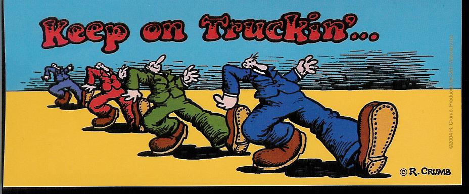

import CaptionedImage from "../../components/CaptionedImage.astro";
import gratefulDeadIcons from "../../images/blog/truckin-through-time/gd_icons.png";
import flowchart from "../../images/blog/truckin-through-time/scraper_flowchart.png";
import Callout from "../../components/Callout.astro";



## Introduction

Using Python, I constructed a Grateful Dead setlist archive (1970s-1990s) from abandoned webpages. This post covers my first experience writing a web scraper to aggregate the Grateful Dead setlist data from [Mark Leone's old Carnegie Mellon website](https://www.cs.cmu.edu/~mleone/).  

<Callout intent="info">
Mark was, I believe, a researcher at CMU. I didn’t delve deeply into Mark’s official role or position. My apologies to Mark if he happens to be reading this! Nonetheless, I appreciate his efforts in aggregating this data; it greatly contributed to the project.
</Callout>

**Tools and Technologies Used**:

- Python
- [BeautifulSoup](https://beautiful-soup-4.readthedocs.io/en/latest/)
- [SQLModel](https://sqlmodel.tiangolo.com/)
- [Ollama (LLama3-8B)](https://ollama.com/)
- SQLite

<Callout intent="info">
  You can find all the code and the SQLite database containing the data I
  scraped on my
  [GitHub](https://github.com/noahgorstein/truckin-through-time/tree/main).
</Callout>

## The Inspiration

A few days ago, I was out on a walk, brainstorming the kind of dataset I wanted to use to learn more about data processing libraries in Python. Then, ["Uncle John's Band"](https://www.youtube.com/watch?v=D2zItg1sBJg&pp=ygUQdW5jbGUgam9obnMgYmFuZA%3D%3D) by the Grateful Dead shuffled on, sparking the idea to explore a Grateful Dead dataset. While I wouldn't call myself a Dead Head 💀, the band's extensive touring history and tendency to record their shows always intrigued me.

I began diving into the depths of Google, searching for Grateful Dead setlist databases, and encountered these long-forgotten websites from the 1990s and early 2000s that enthusiasts had spent considerable time putting together. One such site, [created by Mark Leone](https://www.cs.cmu.edu/~mleone/), a researcher at Carnegie Mellon University, stood out to me because it looked fairly easy to scrape for data. While I’m sure there are beautifully curated and well-structured datasets out there with the same information, I embarked on this journey of writing a web scraper to create my own database from [Mark Leone’s old site at Carnegie Mellon](https://www.cs.cmu.edu/~mleone/). This old website, still hosted on [Carnegie Mellon’s Computer Science Department’s website](https://www.cs.cmu.edu), includes a bunch of random Grateful Dead things, including [setlists from Grateful Dead tours from 1972-1995](https://www.cs.cmu.edu/~mleone/gdead/setlists.html).

<CaptionedImage src={gratefulDeadIcons} alt="Vintage Grateful Dead Mac Icons">
  Vintage Grateful Dead Mac Icons obtained from [Mark Leone's old Carnegie
  Mellon website](https://www.cs.cmu.edu/~mleone/gdead/mac-icons.html). I spent
  a little too much time looking at all the items in the [Apache Directory
  listing](https://www.cs.cmu.edu/~mleone/gdead/)... 😅
</CaptionedImage>

## Project Overview

Before we dive into the technical details, here's a flowchart of how [my simple program](https://github.com/noahgorstein/truckin-through-time/tree/main) works to create this Grateful Dead setlist database:

<CaptionedImage src={flowchart} alt="Flowchart describing webscraper I wrote">
  Flowchart outlining the main steps of the Grateful Dead setlist database
  creation process
</CaptionedImage>

This flowchart outlines the main steps of the program I wrote. The key stages of this process are:

1. **Data Extraction with Web Scraping**: Gathering raw setlist data from abandoned webpages.
2. **Data Processing/Parsing**: Using Ollama (Llama3) to structure the raw data into a usable format.
3. **Persisting the Data**: Storing the processed information in a SQLite database.

This rest of this post details each of these steps. This approach allowed me to transform unstructured web data into a fairly comprehensive, queryable database of Grateful Dead performances.

## Web Scraping

Web scraping is a general technique used to extract information from websites. In this project, I scraped setlist data from Mark Leone’s CMU website, which archived concert setlists of the Grateful Dead. The goal was to compile a comprehensive and structured dataset of these setlists for analysis.

### Why Web Scraping?

The data on the website was not available in a format suitable for analysis. By scraping the website, I transformed this rich, unstructured data into a structured format.

### The Information Architecture

import setlistHome from "../../images/blog/truckin-through-time/setlists_home.png";
import concertList from "../../images/blog/truckin-through-time/setlist_year.png";
import exampleSetlist from "../../images/blog/truckin-through-time/concert_setlist.png";

The data on Mark Leone's CMU website was organized with a setlist "home" page linking to concerts by year. Each year's page included links to text files with the setlists.

<CaptionedImage src={setlistHome} alt="The setlist home page">
  The ["home" page](https://www.cs.cmu.edu/~mleone/gdead/setlists.html) with
  links to concerts from each specific year.
</CaptionedImage>

<CaptionedImage src={concertList} alt="The concert list for 1989">
  The [concert list for a 1989](https://www.cs.cmu.edu/~mleone/gdead/89.html)
  with links to setlists for each concert.
</CaptionedImage>

The text files were mostly structured, though not always consistently - more on how I handled that later on this post.

<CaptionedImage
  src={exampleSetlist}
  alt="The setlist for a show at Henry J Kaiser Convention Center in Oakland, CA on 2/5/89."
>
  The [setlist](https://www.cs.cmu.edu/~mleone/gdead/dead-sets/89/2-5-89.txt)
  for a show at Henry J Kaiser Convention Center in Oakland, CA on 2/5/89.
</CaptionedImage>

### Using BeautifulSoup

To scrape the setlist data, I used Python's [BeautifulSoup](https://beautiful-soup-4.readthedocs.io/en/latest/) library to parse the HTML of the webpages. The code iterates through the "home" page, fetching links for each touring year. For each year, it retrieves information on individual concerts and their setlists, storing everything in structured objects.

Here's the a [code snippet](https://github.com/noahgorstein/truckin-through-time/blob/main/scraper/scraper.py) containing the bulk of my BeautifulSoup usage:

```python
ROOT_URL = "https://www.cs.cmu.edu/~mleone/gdead/"

def get_touring_years() -> list[TouringYear]:
    logger.info("Fetching yearly setlists...")
    response = requests.get(f"{ROOT_URL}/setlists.html")
    if not response.ok:
        logger.fatal(f"Unable to yearly setlists. Status Code: {response.status_code}")
        sys.exit(1)
    soup = BeautifulSoup(response.text, "html.parser")
    # The second ul (list) on that setlist "home" page contains the touring year links
    touring_year_links = soup.find_all("ul")[1].find_all("a")

    touring_years = [
        TouringYear(year=link.text, relative_url=link["href"])
        for link in touring_year_links
    ]
    for touring_year in touring_years:
        logger.info(f"Getting setlists for {touring_year.year}")
        url = f"{ROOT_URL}/{touring_year.relative_url}"
        response = requests.get(url)
        if not response.ok:
            logger.fatal(
                f"Unable to get setlists for year {touring_year.year}. Status Code: {response.status_code}"
            )
            sys.exit(1)
        soup = BeautifulSoup(response.text, "html.parser")
        concert_links = soup.find_all("ul")[0].find_all("a")
        setlists = [
            ConcertData(
                touring_year=touring_year,
                name=link.text.strip(),
                relative_url=link["href"],
            )
            for link in concert_links
        ]

        touring_year.concerts = setlists
    return touring_years
```

<Callout intent="info">
  `TouringYear` and `ConcertData` are just simple [Pydantic](https://docs.pydantic.dev/latest/) models used to store
  the scraped data before processing it further and ultimately writing it to the
  database.
</Callout>

## Extracting Data as JSON with Llama3

### Concert and Venue Information

Parsing the concert data presented challenges due to varying formats. Initially, I used regex to extract venue names, cities, states, and countries, but inconsistencies made this difficult.

For example:

- [**1972**](https://www.cs.cmu.edu/~mleone/gdead/72.html): Formatted consistently, making regex effective:

```text
Winterland Arena, San Francisco, CA (1/2/72)
Academy of Music, New York, NY (3/27/72)
Empire Pool, Wembley, XENG (4/8/72)
City Hall, Newcastle, XENG (4/11/72)
Tivoli Theater, Copenhagen, XDEN (4/15/72)
Aarhus University, Aarhus, XDEN (4/16/72)
```

I managed to write a regex to parse this data, incorporating custom logic to identify international shows by the `"X"` prefix in the country code. However, this was only the beginning of the challenges.

- [**1976**](https://www.cs.cmu.edu/~mleone/gdead/76.html): Minor variations but still parseable:

```text
Paramount Theatre, Portland, Ore. (6/3/76)
Paramount Theatre, Portland, Ore. (6/4/76)
Boston Music Hall, Boston, Mass (6/9/76)
Boston Music Hall, Boston, Mass. (6/10/76)
Boston Music Hall, Boston, Mass. (6/11/76)
Boston Music Hall, Boston, Mass. (6/12/76)
```

- [**1987**](https://www.cs.cmu.edu/~mleone/gdead/87.html): Increased complexity with abbreviations and missing details:

```text
HJK (11/6/87)
HJK (11/7/87)
HJK (11/8/87)
Long Beach Arena (11/13/87)
Long Beach (11/14/87)
Long Beach Arena (11/15/87)
Oakland Coliseum Arena (12/27/87)
```

Regex alone was insufficient for handling these variations (and more). After tweaking the logic several times, I of course tried using ChatGPT to extract the JSON from the setlist. This worked phenomenally.

I considered using OpenAI's API, which even has a JSON mode to ensure only JSON is returned, but the API is not free, and I didn't want to pay for something I was just experimenting with.

I explored running other LLMs locally on my MacBook, starting with [LMStudio](https://lmstudio.ai/). It worked well, except I couldn't get the models it was serving to return JSON reliably. Eventually, I found that [Ollama](https://ollama.com/) provided a solution locally, avoiding any costs. Ollama has a [JSON mode](https://github.com/ollama/ollama/blob/main/docs/api.md#json-mode) that reliably ensures the model response is JSON, simplifying further processing.

### Setlist Information

I faced similar issues when extracting setlist information all individually contained in their setlists. The issues stemmed from the data not being consistently formatted. My first naive approach was to loop over all lines in the text files skipping the first line which always seemed to reliably repeat the concert and information I had already processed.

Extracting setlists faced similar inconsistencies. Initially, I looped over text files, skipping the first line, which repeated concert information. Consistent formats, like the show at [Theatre Tower in Upper Darby, PA on 6/21/76](https://www.cs.cmu.edu/~mleone/gdead/dead-sets/76/6-21-76.txt) was formatted consistently:

```text
Tower Theatre, Upper Darby, PA (6/21/76)

Music Never Stopped
Sugaree
Mama Tried
Brown Eyed Women
Cassidy
Row Jimmy
Looks Like Rain
Scarlet Begonias
Lazy Lightnin'
Supplication
Candyman
Promised Land

The Wheel
Samson and Delilah
Help on the Way
Slipknot!
Franklin's Tower
It Must Have Been the Roses
Dancin' in the Streets
Wharf Rat
Around and Around

Johnny B. Goode
```

However, some shows such at [Delta Center in Salt Lake City, UT on Sunday 2/19/95](https://www.cs.cmu.edu/~mleone/gdead/dead-sets/95/2-19-95.txt) required additional processing:

```
Delta Center, Salt Lake City, UT (Sunday, 2/19/95)

Jack Straw
Sugaree
Walkin' Blues
Alabama Getaway
Me & My Uncle* ->
Big River*
Don't Ease Me In*

China Cat Sunflower ->
I Know You Rider
Samson and Delilah
If the Shoe Fits
New Speedway Boogie ->
Estimated Prophet ->
Drums ->
Space ->
I Need A Miracle ->
Attics of my Life ->
Johnny B. Goode

E: Baby Blue

*Bobby Acoustic
*(first Alabama Getaway since 6/18/89)*
*(soundcheck included Alabama Getaway, Attics, Schoolgirl,
and It's a Man's World)*
```

- The "->" symbol indicates a song transition.
- Footnotes can span more than 1 line and add extra details for certain songs and/or the setlist.
- The encore song is prepended with "E:".

Rather than complicating my initial regex approach with additional logic to handle these variations, I used Ollama to structure setlists into JSON, ensuring accuracy.

### Data Extraction using Ollama

Using the [ollama-python](https://github.com/ollama/ollama-python) library, which is just a simple wrapper around the Ollama server API, this became a lot simpler than trying to create multiple regex patterns to potentially match all the concert and setlist variations.

<Callout intent="info">
  I ran the Ollama server on my 2021 M1 Macbook Pro with 16GM RAM serving
  [Llama3-8B](https://ollama.com/library/llama3).
</Callout>

```python {"Enable JSON mode on Ollama server ":61-62} collapse={17-19, 28-31, 34-42} title="llm.py"
import datetime
import json
import logging

from httpx import ConnectError
from ollama import Client as OllamaClient

from .prompts import PARSE_CONCERT_PROMPT, PARSE_SETLIST_PROMPT

logger = logging.getLogger(__name__)


class LLMParseError(Exception):
    """Represents an error that occurred while the LLM was trying parse and extract information
    out of some given text.
    """

    def __init__(self, msg):
        super().__init__(msg)


class Client:
    """
    A client to interact with the LLM served by Ollama for parsing concert and setlist information.
    """

    def __init__(self, ollama_host: str, model: str):
        self.model = model
        self.ollama_url = ollama_host
        self.client = OllamaClient(host=ollama_host)
        self._validate_config()

    def _validate_config(self):
        """
        Validates the availability of the Ollama server.
        """
        try:
            self.client.list()
        except ConnectError:
            raise RuntimeError(
                f"Failed to establish a connection to the Ollama server running on {self.ollama_url}"
            )

    def _chat_with_llm(self, prompt: str, prompt_formatters: dict[str, str]) -> dict:
        try:
            completion = self.client.chat(
                model=self.model,
                messages=[
                    {
                        "role": "system",
                        "content": (
                            "You are a text extraction assistant. You will be helping me parse concert"
                            " and setlist information from text files."
                        ),
                    },
                    {
                        "role": "user",
                        "content": prompt.format(**prompt_formatters),
                    },
                ],

                format="json",
            )
            content = completion["message"]["content"]
            return json.loads(content)
        except json.JSONDecodeError:
            raise LLMParseError(
                f"LLM did not return valid JSON: {completion['message']['content']}"
            )
        except Exception as e:
            raise LLMParseError(str(e))

    def parse_setlist(self, setlist: str) -> tuple[list[dict], str]:
        message = self._chat_with_llm(
            prompt=PARSE_SETLIST_PROMPT, prompt_formatters={"setlist": setlist}
        )
        songs = message.get("songs", [])
        notes = message.get("notes", "")
        return songs, notes

    def parse_concert_name(
        self, concert: str
    ) -> tuple[str, str, str, str, datetime.date]:
        message = self._chat_with_llm(
            prompt=PARSE_CONCERT_PROMPT, prompt_formatters={"concert": concert}
        )
        venue = message.get("venue", "")
        city = message.get("city", "")
        state = message.get("state", "")
        country = message.get("country", "")
        concert_date_str = message.get("date", "")
        concert_date = datetime.datetime.strptime(concert_date_str, "%m/%d/%Y").date()
        return venue, city, state, country, concert_date
```

<Callout intent="info">
  You can find this [code on
  GitHub](https://github.com/noahgorstein/truckin-through-time/blob/main/scraper/llm.py)
  as well.
</Callout>

I provided the LLM with the following prompts providing examples of what structure I wanted the JSON to be returned in.

```python
PARSE_CONCERT_PROMPT = """
Given the following Grateful Dead concert information, return to me the following information
in a JSON object. Venue, City, State, Country, Date (in format MM/DD/YYYY).
- If country information is not there, use your knowledge based on the concert information to fill it in.
- If the concert does not place in the USA, return null for state and just provide the country.

Do not return to me any additional information about what you returned. Only return the JSON object.

Example concert information:

The Spectrum, Philadelphia, PA (4/22/77)

Example JSON Object:

{{
  "venue": "The Spectrum",
  "city": "Philadelphia",
  "state": "PA",
  "country": "USA",
  "date": "04/22/1977"
}}

This is the concert you need to parse and return JSON for:

{concert}
"""

PARSE_SETLIST_PROMPT = """
Given the following text file representing a setlist from a Grateful dead concert, return to the
me the following information in a JSON object.
- List of songs played and any special notes about the setlist.
    - Use your own judgement to create the notes. They should be concise.
    - A song should be represented with the following information: title, order played, and whether it was transition into another song.
    - Please correct any typos you may find and remove any extraneous information.

Example setlist:

NBC Studios, New York, NY (9/17/87)

Comments: David Letterman

Good Lovin'
All Along the Watchtower
Walkin' the Dog
Tore Up Over You
Kansas City

Masterpiece

Example JSON Object:

{{
  "songs": [
    {{
      "title": "Good Lovin'",
      "order": 1,
      "transition": false
    }},
    {{
      "title": "All Along the Watchtower",
      "order": 2,
      "transition": false
    }},
    {{
      "title": "Walking the Dog",
      "order": 3,
      "transition": false
    }},
    {{
      "title": "Tore Up Over You",
      "order": 4,
      "transition": false
    }},
    {{
      "title": "Kansas City",
      "order": 5,
      "transition": false
    }},
    {{
      "title": "Masterpiece",
      "order": 6,
      "transition": false
    }}
  ],
  "notes": "Played on David Letterman Show"
}}

Here is the setlist for you to parse:

{setlist}


This is the end of the setlist. Please do not return to me any additional information about what you returned. Only return the JSON object.
```

The script took approximately 10 hours to run, primarily due to the inference time for the Ollama server, especially when processing the setlist songs. Below is a snippet of the Ollama server logs. The 20.5-second call was for processing the setlist information, while the 2.6-second call was for processing the concert information. These times varied slightly, but on average, the inference time to process and extract the setlist information was about 9-10 times longer.

```text
[GIN] 2024/07/03 - 01:21:33 | 200 | 20.550543084s |       127.0.0.1 | POST     "/api/chat"
[GIN] 2024/07/03 - 01:21:36 | 200 |  2.627832209s |       127.0.0.1 | POST     "/api/chat"
```

## Structuring the Database Tables

To organize the scraped and processed data, I used a Python library called [SQLModel](https://sqlmodel.tiangolo.com/). It helps define the structure of our database tables based [using Python objects](https://github.com/noahgorstein/truckin-through-time/blob/main/scraper/models.py).

This was the schema I ended up creating:

| Model         | Description                                                                                                                                                                                                                                                         |
| ------------- | ------------------------------------------------------------------------------------------------------------------------------------------------------------------------------------------------------------------------------------------------------------------- |
| `Concert`     | Represents a concert event with attributes like venue (foreign key to **Venue** table), date, and a relationship with Setlist model (one concert can have many setlists).                                                                                           |
| `Venue`       | Represents a venue with attributes like name, city, state (optional), and country.                                                                                                                                                                                  |
| `Song`        | Represents a song with attributes like title and a relationship with **SetlistSong** model (one song can be played in many setlists).                                                                                                                               |
| `Setlist`     | Represents a setlist for a concert with attributes like concert (foreign key to **Concert** table), notes, and relationships with both **Concert** (one concert has many setlists) and **SetlistSong** model (one setlist can have many songs).                     |
| `SetlistSong` | Represents a specific song played in a setlist with attributes like setlist (foreign key to **Setlist** table), song (foreign key to **Song** table), order (position in the setlist), and transition (boolean indicating if there was a transition between songs). |

## Results

When the script completed, I had gathered a good chunk of data. The following are the row counts contained in [my database tables](#structuring-the-database-tables) I wrote to after processing the concert venue and setlist information.

| Table         | Count |
| :------------ | :---- |
| `Venue`       | 484   |
| `Concert`     | 484   |
| `Song`        | 564   |
| `SetlistSong` | 31546 |
| `Setlist`     | 1604  |

It's quite usable in its current form.

For example, we can write queries to answer the following questions.

**How many times was Truckin' played?**

```
sqlite> SELECT COUNT(*) AS times_played
   ...> FROM SetlistSong
   ...> JOIN Song ON SetlistSong.song_id = Song.id
   ...> WHERE Song.title = 'Truckin''';
times_played
------------
426
```

**How many shows were not played in the USA?**

```
sqlite> SELECT COUNT(*) AS shows_not_in_usa
   ...> FROM Concert
   ...> JOIN Venue ON Concert.venue_id = Venue.id
   ...> WHERE Venue.country NOT IN ('USA')
   ...> ;
shows_not_in_usa
----------------
62
```

**How many shows were played each year?**

```
sqlite> SELECT SUBSTRING(date, 1, 4) AS concert_year, COUNT(*) AS number_of_shows
   ...> FROM Concert
   ...> GROUP BY SUBSTRING(date, 1, 4)
   ...> ORDER BY concert_year;
concert_year  number_of_shows
------------  ---------------
1972          87
1973          73
1974          40
1975          4
1976          41
1977          60
1978          81
1979          76
1980          87
1981          86
1982          63
1983          66
1984          64
1985          71
1986          46
1987          86
1988          80
1989          73
1990          74
1991          77
1992          54
1993          82
1994          85
1995          48
```

But there were quite a few [data quality issues](#data-quality-issues) that are going to impact the accuracy of the analysis.

### Data Quality Issues

The script I wrote executed without errors, resulting in a sizable database. Despite not including error handling in my code to process date information, the LLM consistently returned dates in the MM/DD/YYYY format. However, this does not mean everything worked perfectly. There are still some data quality issues that the LLM was unable to resolve. Perhaps if I had provided the LLM with previously processed data, it would have produced more consistent outputs.

For instance, consider some of the Grateful Dead concerts from 1987 that were challenging to parse using regex:

```text
HJK (11/6/87)
HJK (11/7/87)
HJK (11/8/87)
Long Beach Arena (11/13/87)
Long Beach (11/14/87)
Long Beach Arena (11/15/87)
```

I basically told the LLM in the prompt to use its best judgement when extracting concert details.

```
sqlite> select id, name, city, state, country from venue where "name" like "%hjk%";
188|HJK|||USA
189|HJK|unknown||USA
```

It turns out that "HJK" stands for the Henry J. Kaiser Convention Center located in Oakland, CA. Llama3 didn't recognize this, so it returned the data inconsistently: sometimes with empty strings for city and state, and other times with "unknown" for the city.

---

```
sqlite> select id, name, city, state, country from venue where "city" like "%long%";
163|Long Beach Arena|Long Beach|CA|USA
190|Long Beach|Long Beach|CA|USA
```

The show listed as "Long Beach (11/14/87)" should have been written as "Long Beach Arena (11/14/87)," but Llama3 wasn't able to identify and correct this data issue.

---

```
sqlite> select id, title from song where "title" like "%corin%";
65|Corinna
171|Corina
```

Bob Dylan's _Corinna_ that the Grateful Dead covered with him, is spelled with 2 N's and is actually officially titled "Corinna, Corinna".

There are plenty more small issues like this that will require more processing to correct.

## Takeaways

This project was learning experience for me, even though the database I created isn't unique. Modern Grateful Dead sites like [herbibot.com](https://www.herbibot.com/) and [setlist.fm](https://www.setlist.fm/) already have this data cleaned and well-organized. Here are some of my key takeaways:

1. **Web Scraping with BeautifulSoup**: BeautifulSoup proved to be a very useful library for parsing HTML in Python.
2. **Data Extraction with LLMs**: Using Ollama to extract data into structured JSON is amazing. This approach simplified the extraction process, especially when dealing with inconsistent formats. JSON extraction can be incredibly useful for many tasks, and exploring local LLMs can save costs associated with API usage.
3. **Handling Data Inconsistencies**: Despite the LLM's capabilities, some data quality issues persisted. This highlights the importance of combining automated tools with manual verification for critical data projects.
4. **Future Applications**: The methods and tools used in this project have broad applications beyond just creating a Grateful Dead setlist database. They can be adapted for various data extraction and structuring tasks in the _real world_ ™.

Overall, this project was interesting and I learned quite a bit. I hope to clean this data up and do some more thoughful analysis on the setlists.
